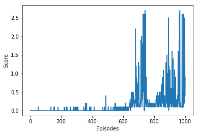

# Report
## The Learning algorithm
> DDPG algorithm (Deep Deterministic Policy Gradients) based on Udacity DRL ddpg-bipedal notebook was used to solve the environment. 

> In this environment, two agents control rackets to bounce a ball over a net. 
>
> If an agent hits the ball over the net, it receives a reward of +0.1. 
>
> If an agent lets a ball hit the ground or hits the ball out of bounds, it receives a reward of -0.01. 
>
> The observation space consists of 8 variables corresponding to the position and velocity of the ball and racket.
>
> Two continuous actions are available, corresponding to movement toward (or away from) the net, and jumping.

## Model
Following structure was used for agent & critic:

+ Feature layer: Linear ReLu (33, 128)
+ First hidden layer: ReLu (128, 64)
+ Second hidden layer: Relu (64, 4)

## Hyperparameters
+ Learning rate (actor): 0.0001
+ Learning rate (actor): 0.001
+ Discount factor (gamma): 0.99
+ Target network update frequency (target_update_frequency): 1000
+ Policy network update frequency (update_frequency): 4
+ Replay memory capacity (buffer_size): 1000000
+ Batch size (batch_size): 1024 

## Performance
> Agent achieves average score **0.5** over 100 episodes at 738 episode. 
At this moment, training could be stopped, task finished.
However, the learning continued and the mean score to end is 0.57.

## Result 

## Comments
During solving this problem, the biggest challenge was to set the learning rate & update frequency.
A small learning rate gave more stable training process, same was observed with update frequency of models. 
Too small was destabilizing training. 

## Future ideas
> I believe the results could be further improved using:

+ Actor and Critic NN could have more layers or more units per layer.
+ Improvements made to DDPG, such as D3PG and D4PG, A3C and PPO will yield better result.
